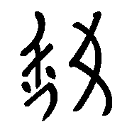
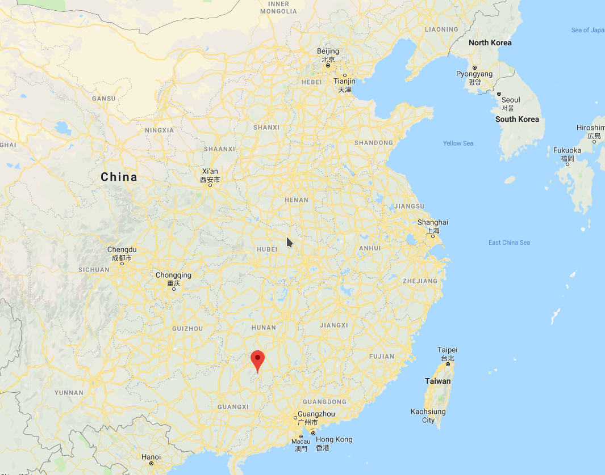
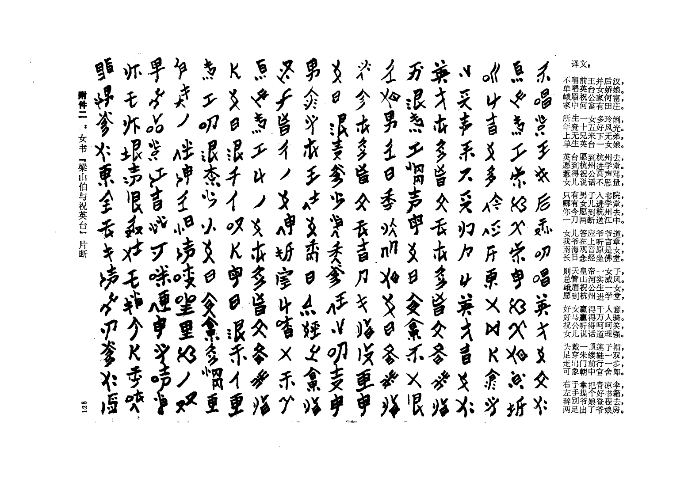

% Nushu (女书): A female-only written script of Chinese
% Changlin Li (mail@changlinli.com)

### What this talk is about

+ Nushu (女书), a written script of Chinese used only by women
+ Discovered in the 20th century, publicized in the 80s

### Preliminaries about written Chinese

+ Logographic (writing represents concepts rather than sounds)
+ One character per morpheme
    * Single-morpheme words (me)
    * Multiple-morpheme words (automobile)
    * 我 (I/me)
    * 电脑 ("Electricity" + "brain" = computer)
+ Many different scripts throughout history

### Oracle bone script

### Bronze script

### Seal script

### Regular script

我

### Discovery process

{ height=500px }

### Process of discovery 1950s-1980s (Part 1)

+ Already disappearing among locals
    * Assumed to be decorative
    * Incomplete (partial substitute for standard written Chinese)
+ Some scattering of people stumbling on it in the 1940s and earlier
+ 1950s Zhou Shuoyi begins cataloging and work with Hu Chishu who gives him a
  corpus
+ Cultural Revolution: Zhou is detained, his works are burned

### Process of discovery 1950s-1980s (Part 2)

+ When Zhou returns Hu is dead
+ 1982: Newly minted philosophy PhD student Gong Zhebing doing anthropological
  studies in the area, hears of the language from the locals
+ Gong meets up with Zhou, tracks down a surviving reader of Nushu, Gao Yinxian
+ 1983: Gong published "A Report On the Study of a Type of Special Script,"
  (关于一种特殊文字的调查报告), leads to widespread recognition

### Characteristics of Nushu

+ Syllabary (with a few exceptions), NOT logograms
+ Mostly derived from Chinese characters
+ Some homegrown logograms

### Subject matter

+ The day-to-day lives of married women
+ Folk songs, poems, and stories

### Example (The story of Zhu Yingtai and Liang Shanbo)

### Origins

+ All over the place
+ Looks based off Regular Script
+ Some of the modifications look like earlier simplifications of Regular Script

### The state of Nushu today

+ At the time of discovery on the brink of extinction
+ Gong knew of two speakers
+ The last natural reader of Nushu died in 2004
    * 阳焕宜 (Yang Huanyi)
+ Lives on in academic study and awareness of it
